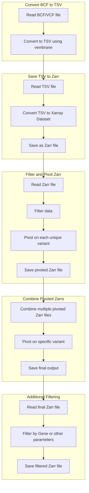

# post-varloc-data-pipeline

<a target="_blank" href="https://cookiecutter-data-science.drivendata.org/">
    
</a>

Data processing after using the snakemake workflow dna-seq-varlociraptor.  Information from bcf or vcf files is extracted using vembrane table --all.  This uses the cookiecutter data science template to organize the project.

## Project Organization

```
├── LICENSE            <- Open-source license if one is chosen
├── Makefile           <- Makefile with convenience commands like `make data` or `make train`
├── README.md          <- The top-level README for developers using this project.
├── data
│   ├── aggregated     <- Aggregated data sets.
│   ├── external       <- Data from third party sources.
│   ├── filtered       <- Filtered data sets.
│   ├── interim        <- Intermediate data that has been transformed.
│   ├── processed      <- The final, canonical data sets for modeling.
│   ├── raw            <- The original, immutable data dump.
│   ├── row_count      <- Files containing row counts or statistics.
│   ├── slurm          <- SLURM job outputs and logs.
│   └── zar            <- Data stored in Zarr format.
│
├── docs               <- A default mkdocs project; see www.mkdocs.org for details
│
├── models             <- Trained and serialized models, model predictions, or model summaries
│
├── notebooks          <- Jupyter notebooks. Naming convention is a number (for ordering),
│                         the creator's initials, and a short `-` delimited description, e.g.
│                         `1.0-jqp-initial-data-exploration`.
│
├── pyproject.toml     <- Project configuration file with package metadata for
│                         post_varloc_data_pipeline and configuration for tools like black
│
├── references         <- Data dictionaries, manuals, and all other explanatory materials.
│
├── reports            <- Generated analysis as HTML, PDF, LaTeX, etc.
│   └── figures        <- Generated graphics and figures to be used in reporting
│
├── requirements.txt   <- The requirements file for reproducing the analysis environment, e.g.
│                         generated with `pip freeze > requirements.txt`
│
├── setup.cfg          <- Configuration file for flake8
│
└── post_varloc_data_pipeline   <- Source code for use in this project.
    │
    │

    ├── extract_ann_types.py        <- Extracts annotation types from VCF or TSV files
    ├── tsv_preprocess_to_zarr.py   <- Preprocesses TSV files and converts them to Zarr format
    ├── vembrane_tsv_to_zarr.py     <- Converts vembrane-generated TSV files to Zarr format
    ├── zarr_groupby_aggregator.py  <- Aggregates Zarr data using groupby operations
    ├── zarr_pivot_creator.py       <- Creates pivot tables from Zarr data
    ├── config.py                   <- Store or access useful variables and configuration
    │
    └── __init__.py                 <- Makes post_varloc_data_pipeline a Python module

--------

<a target="_blank" href="https://cookiecutter-data-science.drivendata.org/">
    
</a>


```




